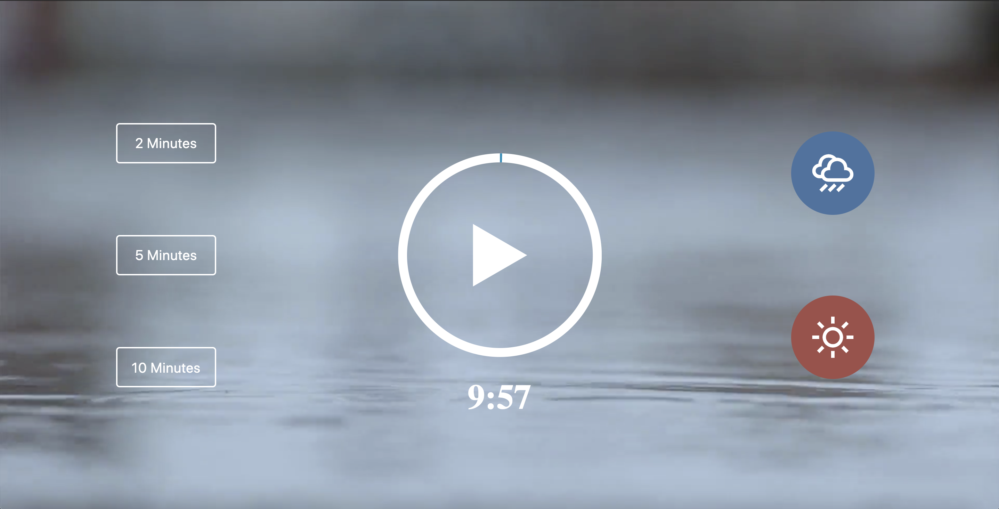
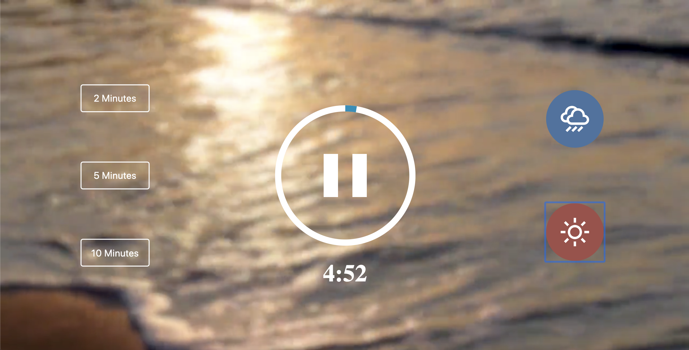

# Meditation-App
https://bbrier14.github.io/Meditation-App/
## Overview
The Meditation App is a vanilla Javascript application that allows the user choose the music and amount of time they would like to meditate. 
## How it Works
The user can pick any one of the three time options as well as the option to listen to the sound of rain or the sound of the ocean. The timer will begin counting down when the time is chosen. The user can choose to pause the app at any time.
## Technologies Used
This application uses HTML5, CSS3, and Javascript. It also incorperates SVG's. 
## Role
This is a solo project.
## Screenshots

